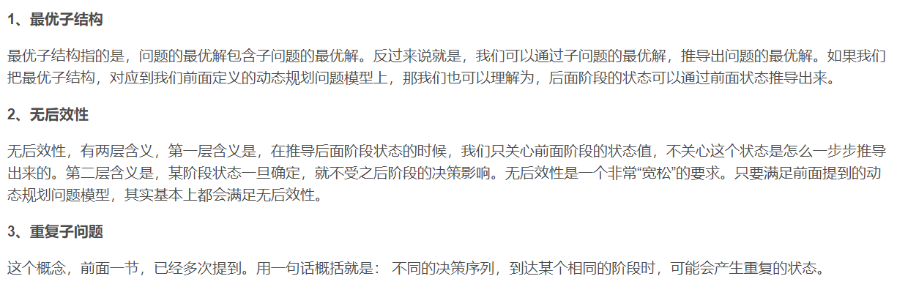

# 算法思想
 
## 贪心
* 最优子结构
* 无后效性
* 每次的局部最优解推出全局最优解
* 每次选定唯一的子问题，不反悔
## 动态规划
* 最优子结构
* 无后效性
* 重复子问题
## 分治
## 回溯
* 解决排列问题
  
# map 和 unodered_map 的一些认知
* 使用`um1[x] == true` 时，会发生insert操作。先查找key，若找不到会插入{x, false}
* 故一般查找元素的存在 使用count 方法
* 查找元素对应的value 使用find 方法
## 不同点
* map 是基于红黑树<bst, 二叉搜索数>实现，保证key从小到大有序，但是查找效率偏低logN
* unordered_map 是基于 hash 实现，不保证有序，但是查找效率较高
* 一般而言查找效率 
  * 自己实现nums 索引key nums[key]为value 
  * unordered_map
  * map
* C++ 大致区域
  * 数据区
  * 代码区 alias'全局区'
  * 栈区
  * 堆区
# C++ 性质
## 输出数据
>
  c++中常用打印
  printf("%lld",long long ) 对应 long long
  printf("lf",double)
  scanf("%d",&n1) 把缓冲区的值放入n1地址对应的变量中
  一般while(scanf(...)!=EOF) || while(~scanf(...))
  
  scanf("%s",&str1)和cin 会忽略开头(空白符)空格、Tab制表、和换行\n。 并且遇到空白符就会停止读入，但不会丢弃。故常常使用getchar()读结尾的/n
  
  getline() 会读取空格，当且遇到/n时才停止，并丢弃/n
  gets() c语言版的 getline
  puts() 输出
  但是scanf("%c",&c1)例外，它会读入开头的空白符
  所有一般在模式前面加上空格(“空格%c”)，这样就可以忽略开头(空白符)空格了
  char c ; cin >> c; 类似于scanf(" %c",&c);会自动忽略丢弃前面的空白符
  遇见数字的时候用char 方式可能错误，因为不知道数字有几位。

## 加快cin/cout速度

ios::sync_with_stdio(false);//取消cin/cout和printf/scanf之间的绑定
cin.tie(0);//取消cin和cout之间的绑定
* 以上为两个函数调用，需要在main函数以内进行
## 

